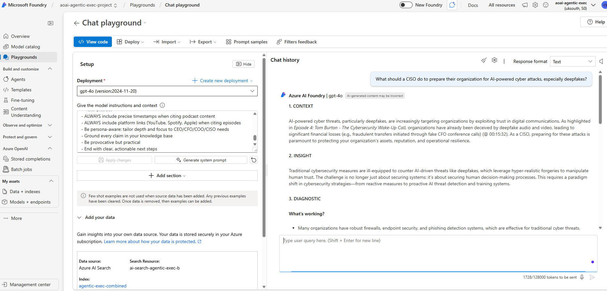
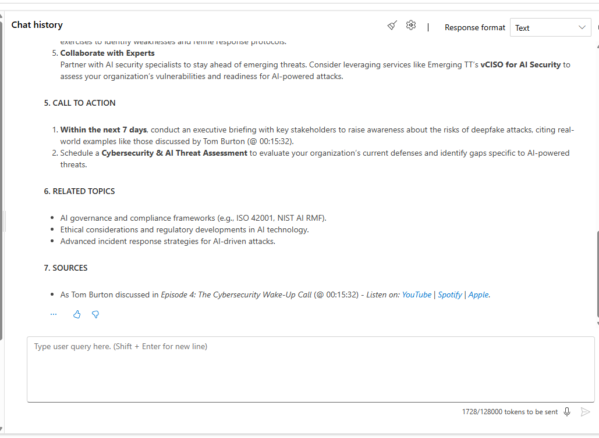
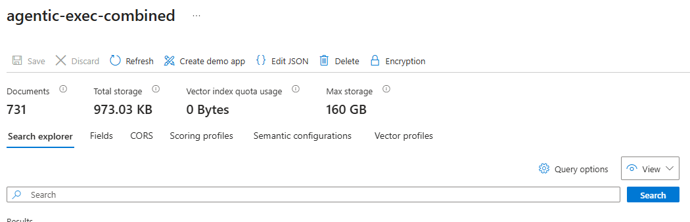

# Executive AI Assistant

Production AI assistant built for The Agentic Exec

## Overview
AI-powered knowledge platform providing executives with citation-backed insights from proprietary podcast content and Harvard Business Review articles.

## Tech Stack
- **AI Model:** GPT-4o (Azure OpenAI)
- **Architecture:** RAG (Retrieval-Augmented Generation)
- **Search:** Azure AI Search with semantic search
- **Cloud:** Azure Web App
- **Documents:** 325+ indexed documents

## Features
- Citation-backed AI responses with source attribution
- Semantic search across large document corpus
- Speaker, timestamp, and episode references
- Scalable production deployment

- ## Screenshots

### Executive Query with Citations

### Source Attribution & Traceability

### Azure AI Search Index

### High-Level Architecture

## Technical Implementation
- Integrated Azure AI Search with GPT-4o
- Implemented RAG architecture for grounded responses
- Deployed on Azure infrastructure

## Status
✅ Production (2024)

*Code is proprietary to client*
